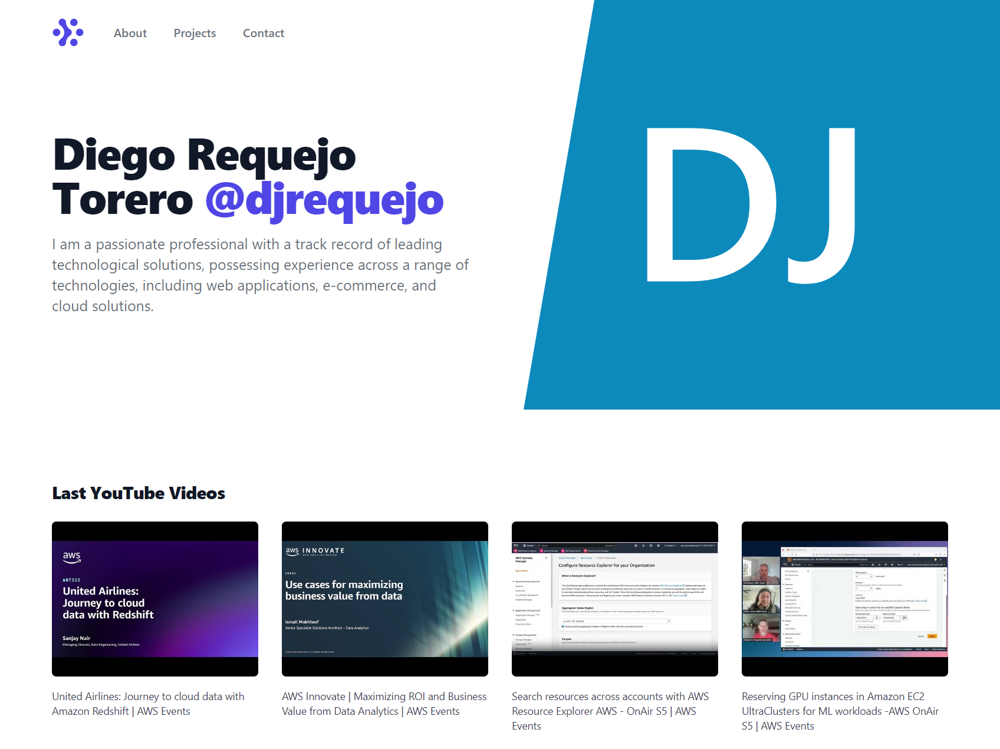

# demo-javascript-asynchronous
This project has excercises abou asynchronous in JavaScript <br />
There are excercises about <code>XMLHttpRequest</code>, <code>Promises</code>, <code>Fetch</code>, <code>Async</code> and more.
Furthermore,this project has integration with the Youtube API through RapidAPI.

## Documentación Oficial JavaScript
https://developer.mozilla.org/es/docs/Web/JavaScript

## 1) Install modules
```
npm i xmlhttprequest
npm i node-fetch
```
## 2) Configuration
Don't forget configure your <code>.env</code> file with:
```bash
X_RAPIDAPI_KEY="Your API Key"
```
## 3) Run Scripts
There are some scripts in <code>package.json</code>.<br />
You can execute:
```
npm run callback
npm run get-products
npm run create-product
```
## GitHub Pages
This project has integration with GitHub Pages. You can view on: https://djrequejo.github.io/demo-javascript-asynchronous.
This landing shows the latest videos from the Amazon Web Services's channel.

